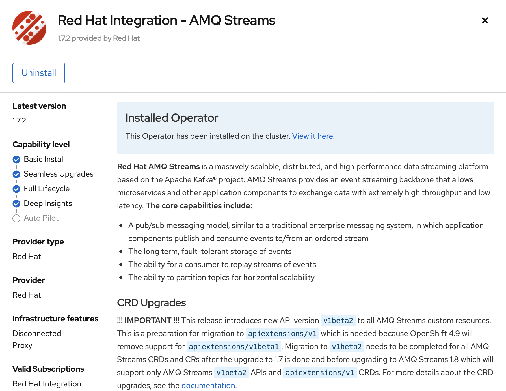
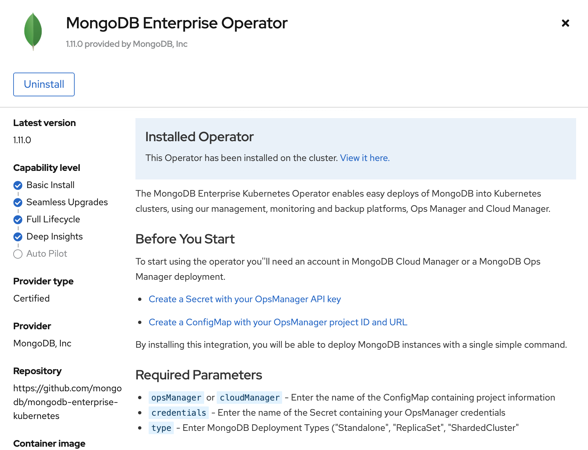
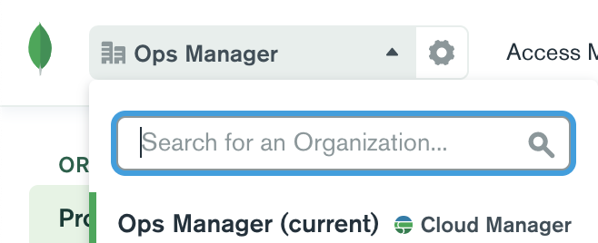
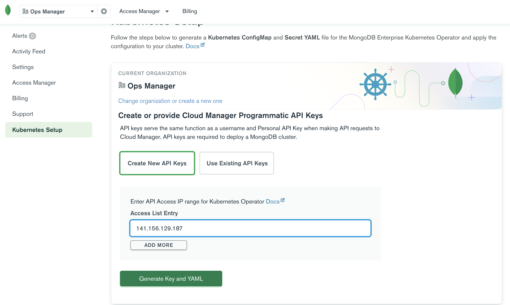
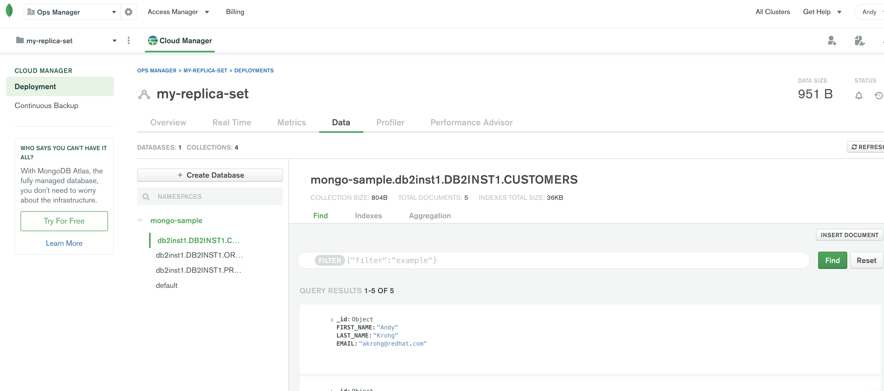

# Zero Code Data Pipeline with the Db2 Debezium Connector
This repo houses collateral to demonstrate a data streaming pipeline using the Debezium Db2 connector as a source and the Kafka Connect PostgreSQL and/or MongoDB connector as a sink.

## Setup
### Kafka and Debezium
1. Clone this repository and `cd` into it:
   ```bash
   git clone https://github.com/andykrohg/db2-debezium.git
   cd db2-debezium
   ```
2. Deploy a Db2 database to OpenShift. These manifests will generate a dummy database called `sample`. The image we're using (`quay.io/debezium/db2-cdc:1.2`) has already fulfilled the [prerequisites to setup Db2 for Debezium](https://debezium.io/documentation/reference/connectors/db2.html#setting-up-db2), which include enabling **capture mode** for the tables we're interested in and deploying the change capture agent to the Db2 host.
   ```bash
   # oc login -u kubeadmin
   oc new-project db2
   oc apply -k openshift/db2/
   ```
3. Install the **Red Hat AMQ Streams Operator** in the Web Console.
   
4. Create `KafkaCluster` and `KafkaConnect` custom resources.
   ```bash
   oc apply -f openshift/kafka/kafka.yaml
   oc apply -f openshift/kafka/kafka-connect.yaml
   ```
   Notice that our `KafkaConnect` instance is using an image named `quay.io/akrohg/debezium-db2connect:latest`, to which we've added the plugins we'll need to talk to Db2, Postgres, and MongoDB. If you're interested, the source for this image is located in `debezium-db2-init/db2connect` within this repository.
5. Create a `KafkaConnector` to start Debezium:
   ```bash
   oc apply -f openshift/kafka-connectors/db2-debezium-connector.yaml
   ```
   Take a look at this file to see how we're filtering tables of interest using the `table.include.list` property. We could optionally use `column.exclude.list` here as well to exclude named columns from the capture set.
6. Observe the creation of three new `KafkaTopics`:
   ```bash
   $ oc get kafkatopics -o name | grep public
   kafkatopic.kafka.strimzi.io/public.customers---8ca8dcfda9fa3ce95ed2659b19d107bbf03b0840
   kafkatopic.kafka.strimzi.io/public.orders---a03e6c4934252138bb668faa61013d62a0ab0b3a
   kafkatopic.kafka.strimzi.io/public.products---14d984dfd09e2a40f4d1929c00b6bb41eb11adfa
   ```
### Using the PostgreSQL Sink Connector
1. Deploy a PostgreSQL Database using the ephemeral template:
   ```bash
   oc new-app --template=postgresql-ephemeral --param=POSTGRESQL_USER=user1 --param=POSTGRESQL_PASSWORD=password
   ```
2. Create a JDBC Sink `KafkaConnector` to execute change events against Postgres:
   ```bash
   oc apply -f openshift/kafka-connectors/postgresql-sink-connector.yaml
   ```
3. Observe that the `CUSTOMERS`, `ORDERS`, and `PRODUCTS` tables have been created and populated with the base dataset in Postgres:
   ```bash
   oc rsh $(oc get pod -l name=postgresql -o name) psql sampledb -c \\dt
   ```
   ```
          List of relations
    Schema |   Name    | Type  |  Owner  
    --------+-----------+-------+---------
    public | CUSTOMERS | table | user1
    public | ORDERS    | table | user1
    public | PRODUCTS  | table | user1
    (3 rows)
   ```
   ```bash
   oc rsh $(oc get pod -l name=postgresql -o name) psql sampledb -c 'select * from "CUSTOMERS";'
   ```
   ```
    ID  | FIRST_NAME | LAST_NAME |         EMAIL         
    ------+------------+-----------+-----------------------
    1001 | Sally      | Thomas    | sally.thomas@acme.com
    1002 | George     | Bailey    | gbailey@foobar.com
    1003 | Edward     | Walker    | ed@walker.com
    1004 | Anne       | Kretchmar | annek@noanswer.org
   ```

### Using the MongoDB Sink Connector
1. Install the **MongoDB Enterprise Operator** from OperatorHub. Be sure to install to the **db2** namespace, not the default of **openshift-operators**.
   
2. Once the operator pod comes up, grab its public IP address:
   ```bash
   oc exec -n db2 $(oc -n db2 get pod -o name --field-selector spec.serviceAccountName=mongodb-enterprise-operator) -- curl -s ifconfig.me && echo
   ```
3. Create an account or login at https://cloud.mongodb.com/. Ensure that you're a member of a **Cloud Manager** organization.
   
4. Click **Kubernetes Setup** on the left pane, select **Create New API Keys**, and enter the operator pod's public IP into the **Access List Entry** field. Then click **Generate Key and YAML**, and apply the provided manifests to your cluster in the **db2** namespace. (You may need to remove the default namespace of **mongodb** from the manifests first.)
   
5. Create a `Mongo DB Deployment` using the operator in the web console. Set **Cloud/Ops Manager credentials** to the `Secret` you just created (**organization-secret** is the default name), and accept all other defaults. This will create a `ReplicaSet` deployment named `my-replica-set` and register the instance to https://cloud.mongodb.com.
6. Create a MongoDB Sink `KafkaConnector` to execute change events against MongoDB:
   ```bash
   oc apply -f openshift/kafka-connectors/mongodb-sink-connector.yaml
   ```
7. In MongoDB Ops Manager, go to **Projects -> my-replica-set** and click on the Deployment. Then switch to the **Data** tab, and you should see three new collections: one for each of the three tables we set to capture mode.
   
## Running the Demo

In a new Terminal, add a new row to the `CUSTOMERS` table in the **Db2 Database**:
```bash
oc rsh $(oc get pod -l app=db2 -o name) su - db2inst1
```
```bash
db2 connect to sample
```
```bash
db2 "INSERT INTO CUSTOMERS (FIRST_NAME, LAST_NAME, EMAIL) VALUES ('Andy', 'Krohg', 'akrohg@redhat.com')"
```
`UPDATES` and `DELETES` should trigger change events as well.

### Observing the changes in Postgres
In the Postgres terminal (after a moment), observe that the new row appears in the `CUSTOMERS` table:
```bash
oc rsh $(oc get pod -l name=postgresql -o name) psql sampledb -c 'select * from "CUSTOMERS";'
```

### Observing the changes in MongoDB
Simply click **Refresh** on the **Data** view in Ops Manager, and your data changes should be newly-reflected.


